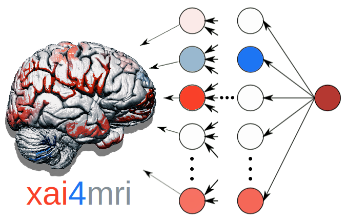

# xai4mri

***
    Date: 2024
    Status: in prep
    Author(s): Simon M. Hofmann
***

## Project description

**xai4mri** is designed for advanced MRI analysis combining deep learning with explainable A.I. (XAI). It offers the following key functionalities:

- **Model Loading**: load (pretrained) 3D-convolutional neural network models tailored for MRI predictions.
- **Data Integration**: Effortlessly import new MRI datasets and apply the models to generate accurate predictions.
- **Interpretation Tools**: Utilize analyzer tools, such as Layer-wise Relevance Propagation (LRP), to interpret model predictions through intuitive heatmaps.

With **xai4mri**, you can complement your MRI analysis workflow, ensuring precise predictions and insightful interpretations.

> Note, **xai4mri** will be released soon (end of 2024). Stay tuned!
