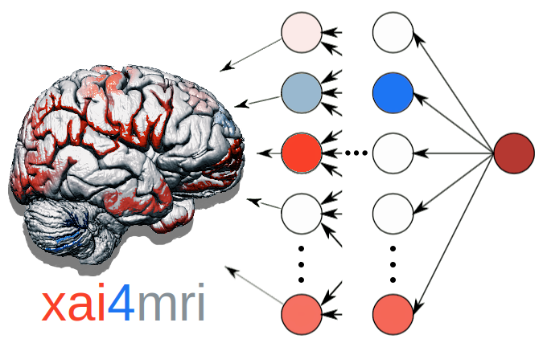

# Quick overview




The package can be loaded with:

```python
import xai4mri as xai
```

## Loader for MRI datasets

Functions to effectively load MRI data for model training and evaluation are in the `dataloader` submodule.

Build your own dataset class. For this, inherit from the `BaseDataSet` class:

```python
from xai4mri.dataloader import BaseDataSet
```

See [**Loading data**](dataloading.md) for more information.

## Deep learning models for MRI prediction

Deep learning models are implemented in [`Keras`](https://www.tensorflow.org/guide/keras).
This is required for the model analyzer to work,
which is based on the [`iNNvestigate`](https://github.com/albermax/innvestigate) package.

Models provided by `xai4mri` can be trained from scratch or loaded with pretrained weights.

Among others, the package offers models based on
[Hofmann et al. (2022, *NeuroImage*)](https://doi.org/10.1016/j.neuroimage.2022.119504),
i.e., 3D-CNNs (`MRInet`) that are trained to predict age from various MRI modalities (`T1w`, `FLAIR`, `SWI`).

For instance, get the `MRInet` model with:

```python
from xai4mri.model.mrinets import MRInet
```

See [**Model training**](models.md) for more information.

### Transfer pretrained models to new MRI datasets and prediction tasks

When using pretrained models, transfer learning can be applied. Find the relevant methods in

```python
from xai4mri.model.transfer import *
```

!!! warning "Under construction"
    However, note that functions for transfer learning are not fully implemented yet.

See [**Model transfer**](transfer.md) for more information.

## Model interpretation

Code for model interpretation using explainable A.I. (XAI) methods can be found in the `interpreter` submodule.

To analyze the predictions of a model, import the following:

```python
from xai4mri.model.interpreter import analyze_model
```

This is built on top of the XAI package [`iNNvestigate`](https://github.com/albermax/innvestigate).
The provided methods should work also with CNN architectures other than those offered by `xai4mri`,
given that the models are implemented in [`Keras`](https://www.tensorflow.org/guide/keras).


See [**Model interpretation**](interpretation.md) for more information.

## Examples & tutorials

For examples and tutorials, see the [**Examples**](examples.md) page.

## Citation

When using `xai4mri`, please cite the following papers:
[`toolbox paper in prep`] and [Hofmann et al. (2022, *NeuroImage*)](https://doi.org/10.1016/j.neuroimage.2022.119504).
